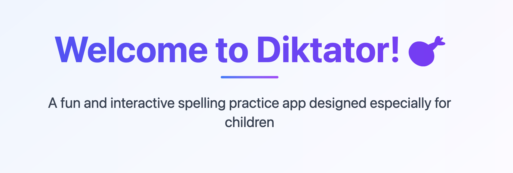

# Diktator



Diktator is a web application designed to help children learn Norwegian vocabulary through gamified tests and practice modes. It features a modern frontend built with Next.js and TypeScript, a backend API in Go, and uses OIDC for authentication with PostgreSQL for data storage.

## Features

- 🌍 **Multilingual Support**: English and Norwegian (🇬🇧/🇳🇴)
- 🔐 **OIDC Authentication**: Flexible identity provider support with mock mode for development
- 🎮 **Gamification**: Score tracking, progress monitoring, and statistics
- 🎯 **Practice Modes**: Hover-to-reveal word practice with speech synthesis
- 📊 **Analytics**: Detailed test results and performance tracking
- 👥 **User Profiles**: Personal statistics and progress history

## Architecture

- **Frontend**: Next.js 16 with TypeScript, Tailwind CSS
- **Authentication**: OIDC (mock mode for development, configurable provider for production)
- **Database**: PostgreSQL for user data, test results, and analytics
- **Backend**: Go with Gin HTTP framework
- **Deployment**: Google Cloud (Cloud Run + Cloud Storage)
- **Development**: Docker Compose for local services

## Quick Start

### 1. Prerequisites

- Node.js 20+
- Go 1.25+
- Docker & Docker Compose
- [mise](https://mise.jdx.dev/) (recommended for tool management)

### 2. One-Command Setup

```bash
# Clone the repository
git clone https://github.com/starefossen/diktator.git
cd diktator

# Install mise if you haven't already
curl https://mise.run | sh

# Complete setup (tools, dependencies, PostgreSQL)
mise run setup
```

### 3. Start Development

```bash
# Start full development environment (PostgreSQL + frontend + backend)
mise run dev

# Or start components individually:
mise run frontend:dev     # Frontend only (:3000)
mise run backend:dev      # Backend only (:8080)
mise run backend:start    # Backend in background
mise run db:start         # PostgreSQL only
```

### 4. Quality Assurance

```bash
# Run all quality checks
mise run test              # Lint + typecheck + tests

# Individual checks
mise run lint             # ESLint (frontend) + go vet (backend)
mise run format           # Format all code (prettier + go fmt + tofu fmt)
mise run typecheck        # TypeScript check + Go build check
```

### 5. Access the Application

- 🌐 **Frontend**: http://localhost:3000
- 🔧 **Backend API**: http://localhost:8080
- 📖 **API Docs**: http://localhost:8080/docs
- 🗄️ **PostgreSQL**: localhost:5432

## Development URLs

| Service      | URL                        | Purpose                      |
| ------------ | -------------------------- | ---------------------------- |
| Frontend App | http://localhost:3000      | Main application             |
| Backend API  | http://localhost:8080      | Go API server                |
| API Docs     | http://localhost:8080/docs | Swagger documentation        |
| PostgreSQL   | localhost:5432             | Database (postgres/postgres) |

## Available Tasks

### Core Development

- `mise run dev` - Start full development environment
- `mise run frontend:dev` - Frontend development server only
- `mise run backend:dev` - Backend with hot reload (air)
- `mise run backend:start` - Start backend in background
- `mise run backend:stop` - Stop background backend
- `mise run backend:restart` - Restart background backend
- `mise run backend:logs` - View backend logs
- `mise run backend:status` - Check backend status

### Database Management

- `mise run db:start` - Start PostgreSQL
- `mise run db:stop` - Stop PostgreSQL
- `mise run db:reset` - Reset database (destroy and recreate)
- `mise run db:migrate` - Run database migrations
- `mise run db:shell` - Open PostgreSQL shell
- `mise run db:seed` - Seed database with test data
- `mise run db:reset-seed` - Reset database and seed with fresh test data

### Testing

**Run All Tests:**
- `mise run test` - All tests (lint + typecheck + backend + frontend unit tests)
- `mise run test-all` - Complete suite including E2E tests
- `mise run check` - Alias for `test`

**Backend Tests:**
- `mise run backend:test` - All backend tests (requires PostgreSQL)
- `mise run backend:test-short` - Unit tests only (skip integration)
- `mise run backend:test-coverage` - Backend tests with coverage report

**Frontend Tests:**
- `mise run frontend:test` - Frontend unit tests (Vitest)
- `mise run frontend:test-watch` - Frontend tests in watch mode
- `mise run frontend:test-coverage` - Frontend tests with coverage
- `mise run frontend:test-e2e` - E2E tests with Playwright (requires running backend)
- `mise run frontend:test-e2e-ui` - E2E tests with Playwright UI

**Quick Tests:**
- `mise run test-unit` - Unit tests only (backend + frontend, skip integration)

### Quality Assurance

- `mise run lint` - Lint all code (ESLint + go vet)
- `mise run format` - Format all code (prettier + go fmt + tofu fmt)
- `mise run typecheck` - Type checking (TypeScript + Go build check)
- `mise run frontend:knip` - Find unused code in frontend
- `mise run frontend:knip-fix` - Auto-fix unused code in frontend

### API Documentation

- `mise run backend:swagger-gen` - Generate OpenAPI spec from Go code
- `mise run frontend:client-gen` - Generate TypeScript client from OpenAPI

### Build & Deployment

- `mise run build` - Build all components for production
- `mise run backend:docker-build` - Build backend Docker image locally
- `mise run backend:deploy` - Deploy backend to Cloud Run
- `mise run frontend:deploy` - Deploy frontend to Cloud Storage
- `mise run clean` - Clean build artifacts

### Infrastructure (OpenTofu)

- `mise run tofu:init` - Initialize OpenTofu
- `mise run tofu:plan` - Plan infrastructure changes
- `mise run tofu:apply` - Apply infrastructure changes
- `mise run tofu:fmt` - Format Terraform/OpenTofu files

### Configuration

- `mise run setup` - Complete project setup
- `mise run config-dev` - Generate development configuration
- `mise run config-prod` - Generate production configuration
- `mise run config-load` - Load configuration from terraform
- `mise run config-check` - Check all configuration values

## Configuration

### Development Mode

In development, the app runs with:
- **AUTH_MODE=mock**: Authentication is mocked, no real OIDC provider needed
- **PostgreSQL**: Running in Docker on localhost:5432
- **Storage**: Mock storage or local GCS credentials

### Production Mode

For production, configure:
- **AUTH_MODE=oidc**: Real OIDC provider (Keycloak, Auth0, etc.)
- **DATABASE_URL**: Production PostgreSQL connection string
- **OIDC_ISSUER_URL**: Your OIDC provider URL
- **OIDC_AUDIENCE**: Expected token audience

See [docs/CONFIGURATION.md](docs/CONFIGURATION.md) for detailed configuration options.

## Project Structure

```text
.
├── backend/                 # Go API server
│   ├── cmd/server/         # Application entrypoint
│   ├── handlers/           # HTTP handlers
│   ├── internal/           # Private application code
│   │   ├── middleware/     # HTTP middleware (auth)
│   │   ├── models/         # Data models
│   │   └── services/       # Business logic (db, tts, storage)
│   ├── docs/               # Swagger documentation
│   └── Dockerfile          # Backend container
├── frontend/               # Next.js application
│   ├── src/               # Source code
│   │   ├── app/           # Next.js App Router pages
│   │   ├── components/    # React components
│   │   ├── contexts/      # Auth context (OIDC)
│   │   └── lib/           # Utilities and API clients
│   └── public/            # Static assets
├── terraform/             # Infrastructure as Code (OpenTofu)
├── migrations/            # Database migrations
├── docs/                  # Documentation
├── docker-compose.dev.yml # Local development services
├── mise.toml              # Task runner configuration
└── .github/workflows/     # CI/CD pipelines
```

## Authentication Flow

### Development (Mock Mode)
1. Set `AUTH_MODE=mock` in backend
2. Set `NEXT_PUBLIC_AUTH_MODE=mock` in frontend
3. Any login credentials work, creating a mock user session

### Production (OIDC)
1. Configure OIDC provider (Keycloak, Auth0, Okta, etc.)
2. Set `AUTH_MODE=oidc` with `OIDC_ISSUER_URL` and `OIDC_AUDIENCE`
3. Frontend redirects to OIDC provider for login
4. Backend validates JWT tokens from provider

## Deployment

### Infrastructure Setup

The infrastructure uses OpenTofu (open-source Terraform):

```bash
# Setup using your current gcloud project
mise run tofu:init
mise run tofu:plan
mise run tofu:apply
```

### Application Deployment

```bash
# Deploy backend to Cloud Run
mise run backend:deploy

# Deploy frontend to Cloud Storage
mise run frontend:deploy
```

### Required Secrets

Configure these secrets in your GitHub repository:

- `GCP_SA_KEY`: Google Cloud Service Account JSON key
- `GCP_PROJECT_ID`: Google Cloud Project ID
- `GCP_FRONTEND_BUCKET`: Cloud Storage bucket name for frontend

See [docs/ENVIRONMENT.md](docs/ENVIRONMENT.md) for detailed environment variable documentation.

## Contributing

1. Create a feature branch
2. Make your changes
3. Test locally with `mise run test`
4. Submit a pull request

For AI assistance, see [GitHub Copilot Instructions](.github/copilot_instructions.md) for project-specific guidance.

## License

MIT
